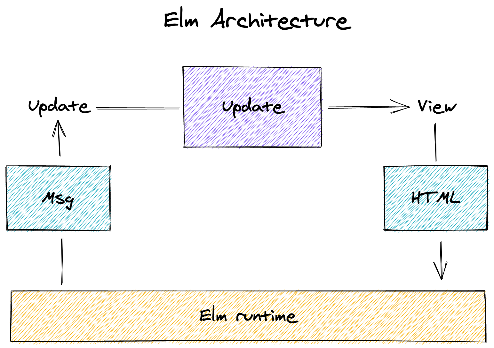

# Notes

## Records

- plain immutable data
- mix types allowed
- no way to iterate over records, due to mixed data types

```elm
record = {name = "foo", x = 1, y = 3}

record.name -> "foo"
```

- No prototype
- no this
- no mutating

```elm
record = {name = "foo", x = 1, y = 3}

-- This
-- kind of link spreading in js
newRecord = {record | name = "bar"}

-- same as this
{- newRecord = 
{name = "bar"
, x = 1
, y = 3}
-}
```

## Booleans

`True` or `False`

```elm
x == y -- True
not (x == y) -- long hand
x /= y -- short hand for negation !=
x || y
x && y
```

```elm
isKeepable num = num > 1

List.filter isKeepable [1,2,3] -- [2,3]

-- we could also inline the function
List.filter (\num -> num > 1) [1,2,3] -- [2,3]
```

## Elm architecture



### view

- `view` gets passed a model (entire application state) and returns some html
- the elm runtime handles porcess and display the html

### update

- `update` gets the model and a msg. The msg is from the "outside" world
and tells update what has happened (use interaction, form field updated)
  
```elm
update msg model =
    {model | selectedTag = "elm"}
```

- `update` returns a new model, allowing transitioning to a new
state

- `msg` is just a record detailing what happened.

```elm
   button 
   [ onClick
        { description = "ClickedTag"
        , data = "elm"
        }
   ]
   [ text "elm"]
```
